# SPE Untapped Energy Datathon

CO2 emissions are the release of carbon dioxide into the atmosphere from burning fossil fuels and industrial processes, contributing to global warming and climate change.
Carbon Capture, Utilization, and Storage (CCUS) is a vital technology for reducing CO2 emissions from hard-to-decarbonize industries like cement and steel. It captures CO2 from sources such as power plants, preventing it from entering the atmosphere, and either reuses or stores it underground. Key factors affecting CCUS projects include the efficiency and cost of capture technologies, the availability of storage sites, economic considerations like high initial costs and market demand, supportive government policies and international agreements, and public acceptance and environmental impact. Overcoming these challenges is essential for the successful deployment of CCUS and achieving net-zero emissions.

## Data Analysis and Machine Learning 

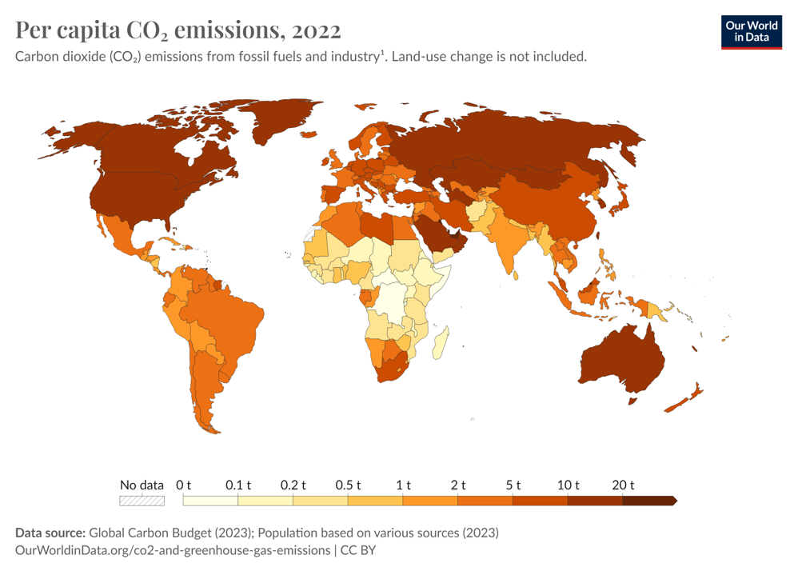
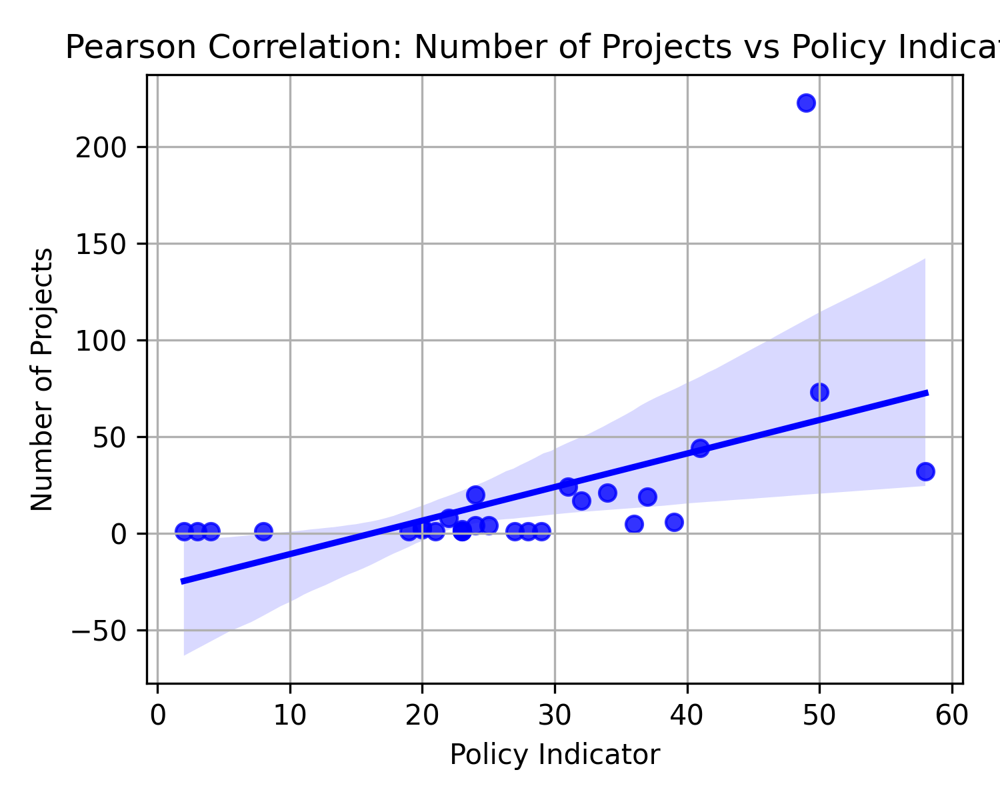
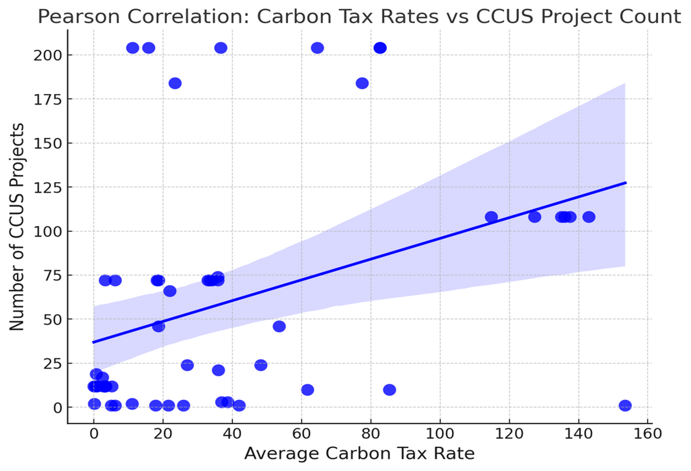
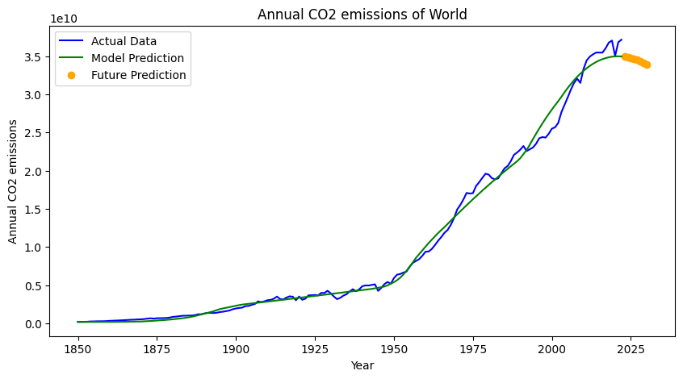
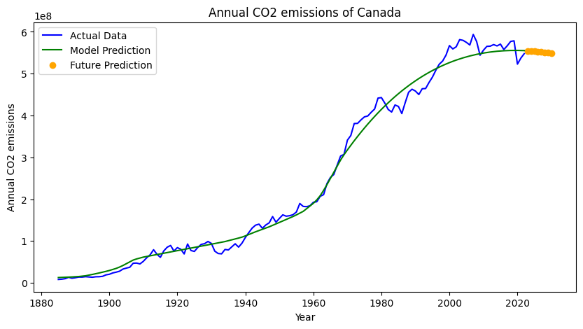
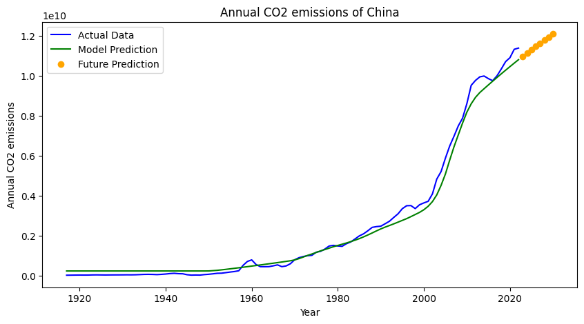
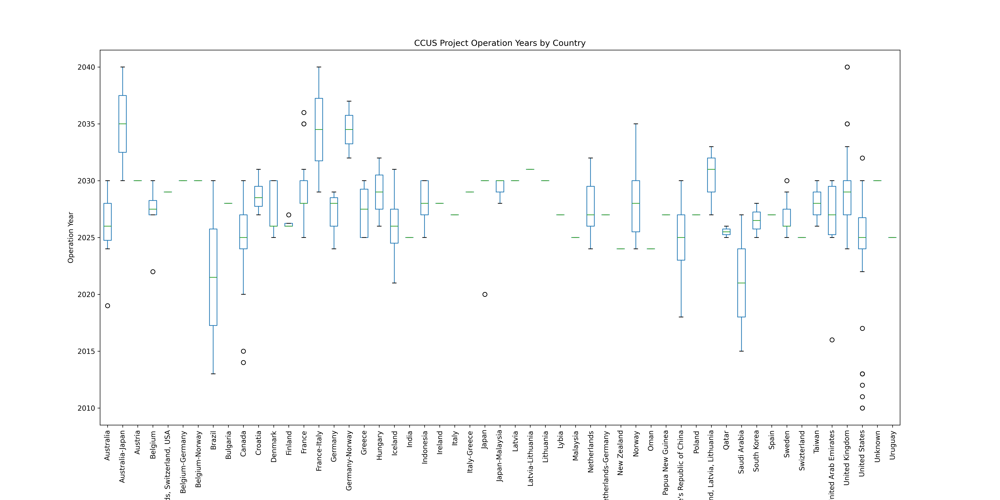
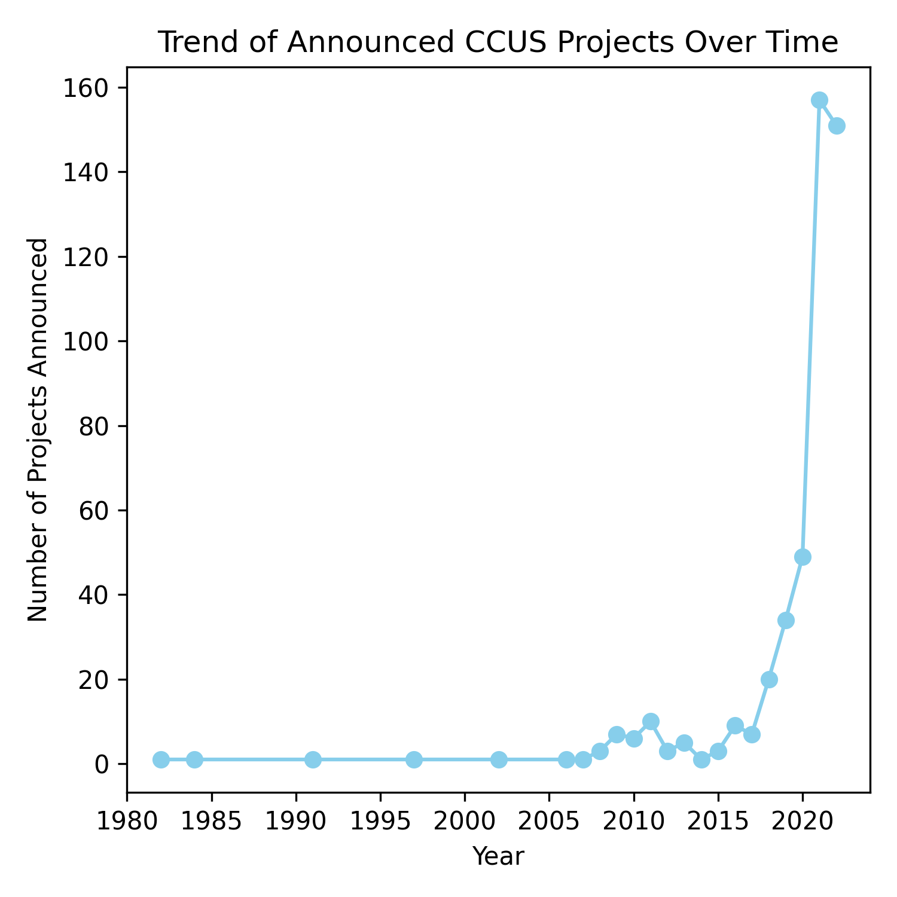
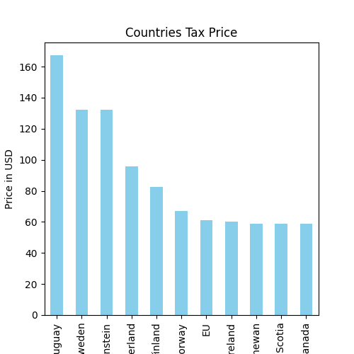
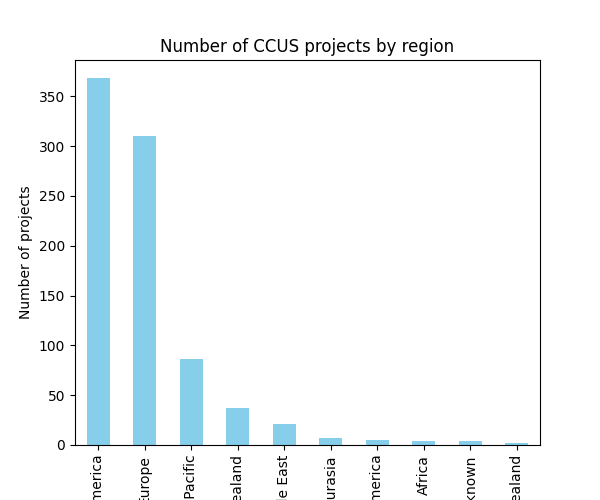
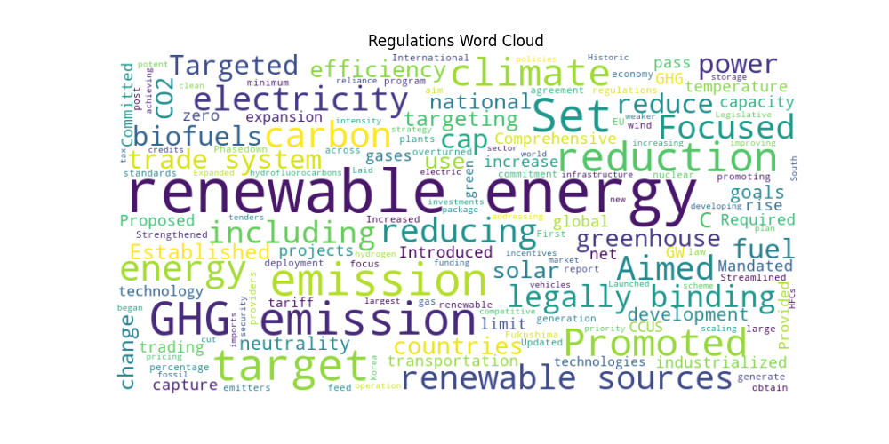
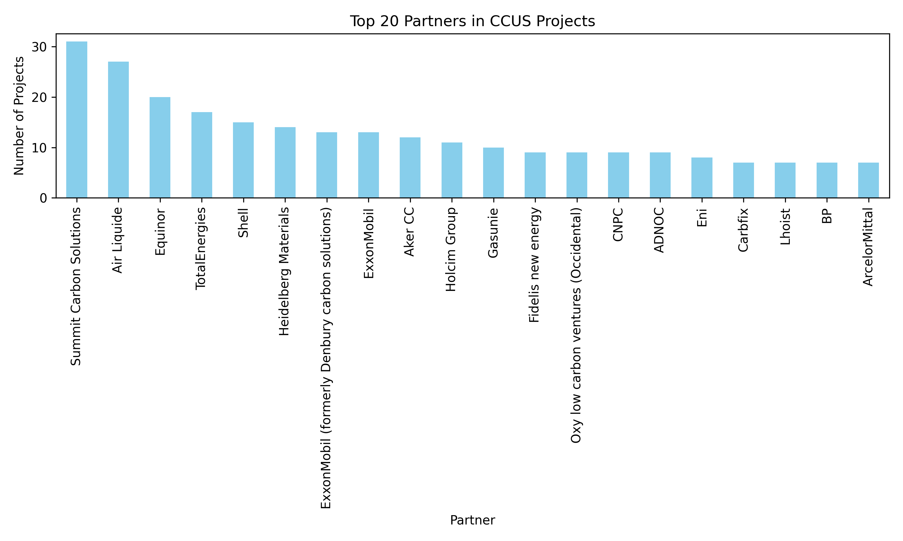
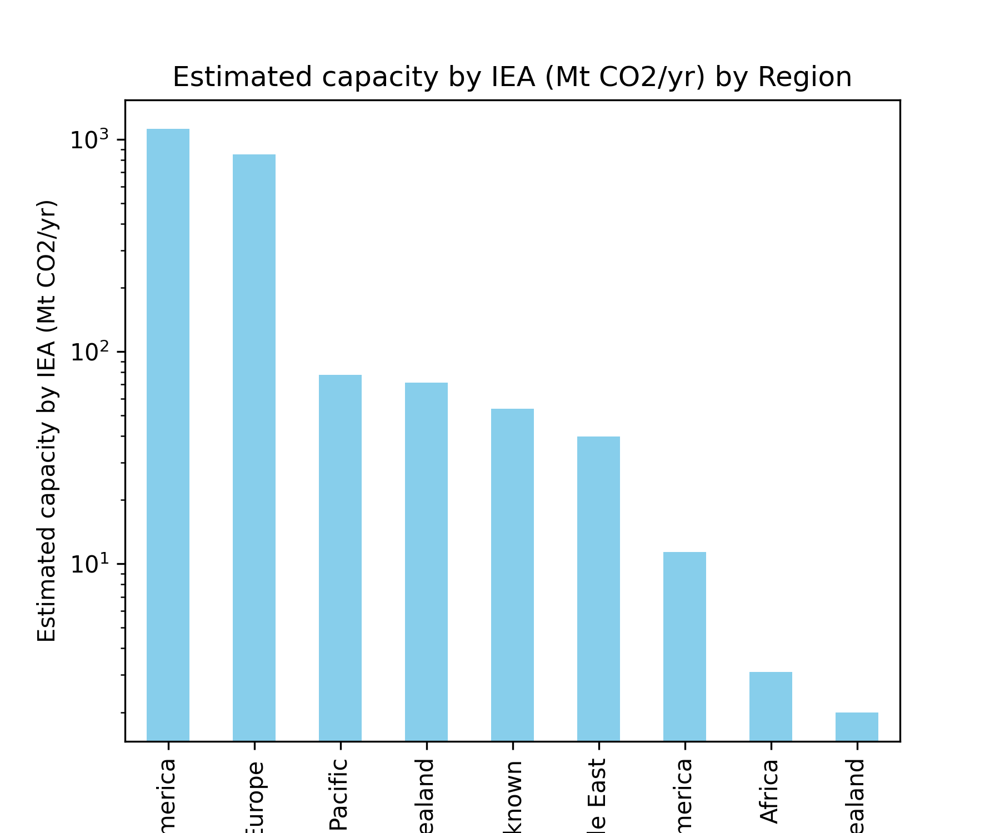
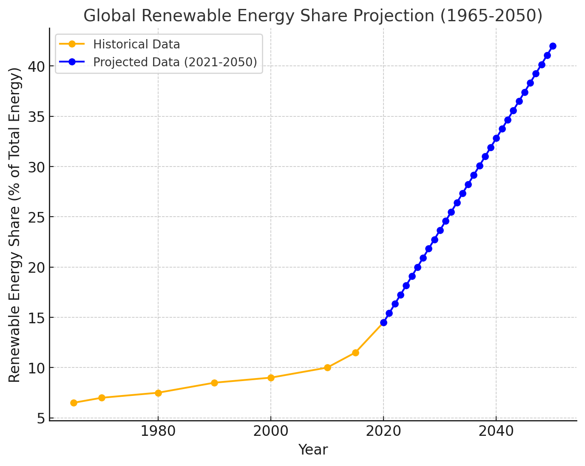
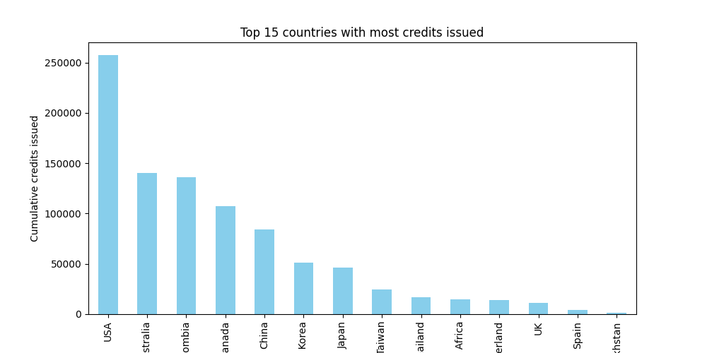

